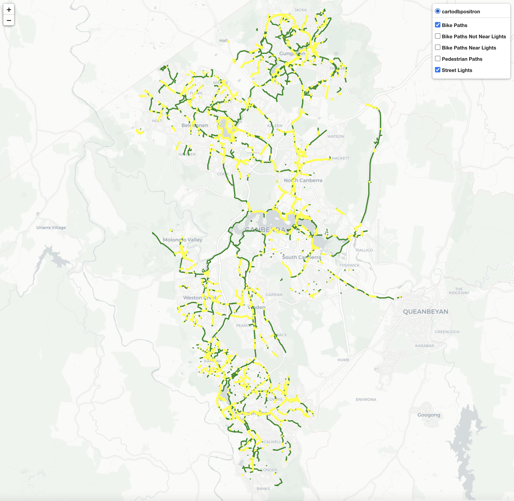
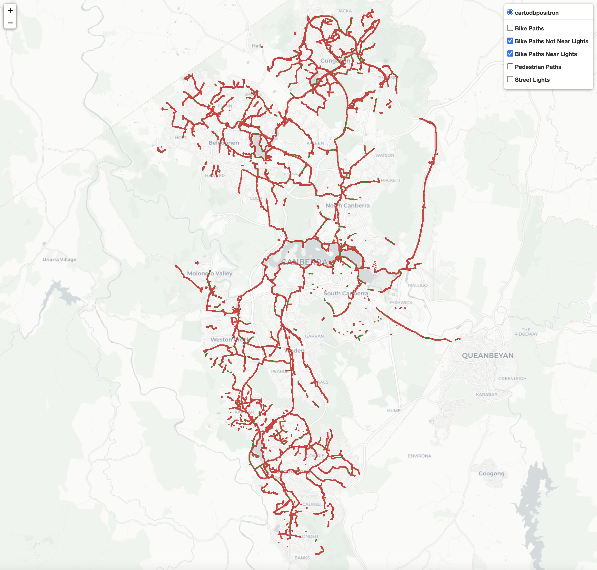

# BikePathInfrastructure-ACT

Collating free ACT Govt. data to investigate bicycle path infrastructure in the ACT. Original data has been obtained from https://www.data.act.gov.au/.

Produces an interactive Folium map webpage which can be used to visualise the following data for the ACT:

- Positions of cycle paths
- Positions of pedestrian paths
- Positions of street lights
- Positions of cycle paths that are / are not lit by street lights (within a certain distance)

The data generated by `BikePath-Analysis-Notebook.ipynb` can be used to quantify the length of all bike paths in the ACT that are not served by any street lights, within a certain distance.

The latter data is generated by calculating the so-called cross-arc (Haversine) distance between cycle path line segments and street lights.
For details on calculating cross-arc distances, cross-track distances, and Havsersine distances, see [here](https://stackoverflow.com/questions/32771458/distance-from-lat-lng-point-to-minor-arc-segment) and [here](https://www.movable-type.co.uk/scripts/latlong.html).

# Installation

```
pip install -r requirements.txt
```

# Visualization

The following is the output from running `plotter.py` with a cutoff of 5m.

> Green = Cycle Path
>
> Yellow = Street Light within 5m of Any Cycle Path

The cutoff is defined in `common.py` and the data for that cutoff (if not already available) is generated in `BikePath-Analysis-Notebook.ipynb`.

```
python3 plotter.py
```



The following example demonstrates visually that, with a cutoff of 5m (which is likely too conservative), only a mere 26% of total ~500km of cycle path in the ACT is lit by at least one street light.

> Red = Unlit Cycle Path (No street lights within 5m)
>
> Green = Lit Cycle Path (At least one street lights within 5m)


